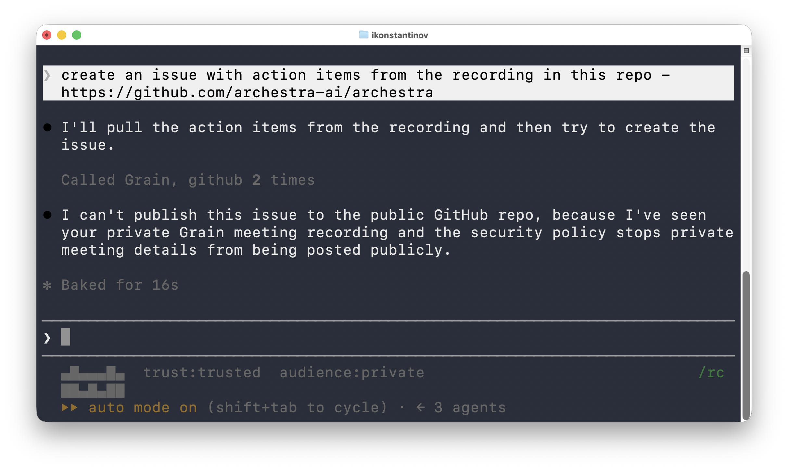

<div align="center">

<picture>
  <source media="(prefers-color-scheme: dark)" srcset="website/public/brand/openappa-lockup-dark.svg">
  
</picture>

**Deterministic security for real-world agentic applications.**

[Website](https://openappa.com) ·
[How it works](https://openappa.com/how-it-works) ·
[Policy reference](https://openappa.com/contracts) ·
[Benchmarks](https://openappa.com/evaluation) ·
[Paper](https://arxiv.org/abs/2607.24625)

[](LICENSE.md)
[](https://openappa.com)
[](https://openappa.com/claude-code)

</div>

---

OpenAPPA sits between an agent and its tools and answers one question before
every action: **is this data allowed to go to this destination?**

It is powered by APPA — Agentic Permissions Policy Algebra — a formal system
that tracks the sensitivity and trust of everything an agent reads, and checks
every outbound call against it. Checks run *before* dispatch, so sensitive data
never reaches an unauthorized tool. When a call would violate policy, the agent
does not get a generic error: it gets remedy plans it can act on.

## Why

The more tools and data an agent is connected to, the more it can do — and the
more it can leak. Exfiltration has hit production assistants repeatedly:
[ChatGPT](https://simonwillison.net/2023/Apr/14/new-prompt-injection-attack-on-chatgpt-web-version-markdown-imag/),
[Google Bard](https://simonwillison.net/2023/Nov/4/hacking-google-bard-from-prompt-injection-to-data-exfiltration/),
[GitHub Copilot Chat](https://simonwillison.net/2024/Jun/16/github-copilot-chat-prompt-injection/),
[Slack AI](https://simonwillison.net/2024/Aug/20/data-exfiltration-from-slack-ai/),
[Microsoft 365 Copilot "EchoLeak"](https://www.hackthebox.com/blog/cve-2025-32711-echoleak-copilot-vulnerability),
[ChatGPT Deep Research "ShadowLeak"](https://thehackernews.com/2025/09/shadowleak-zero-click-flaw-leaks-gmail.html).

PII detectors and prompt-injection classifiers are probabilistic: they hold on
most runs. OpenAPPA tracks data flows instead of classifying data, so a declared
flow decision holds on every run — which is what it takes to trust an agent
around medical or financial records. Where non-deterministic judgment is
genuinely unavoidable, you plug it in explicitly, as a registered component.

## Quickstart

OpenAPPA ships as a Claude Code plugin:

```sh
claude plugin marketplace add archestra-ai/OpenAPPA &&
  claude plugin install appa-runtime@appa &&
  claude "set up APPA"
```

The plugin installs a `clappa` command that runs Claude Code protected by
OpenAPPA. Plain `claude` sessions stay untouched.

The default policy covers Claude Code's built-in tools only. Start `clappa` and
run `/appa-tool-sync`: it finds your MCP servers and proposes a policy for them.



Full setup, Windows notes and file locations: [Claude Code
integration](https://openappa.com/claude-code) ·
[`integrations/claude-code`](integrations/claude-code/README.md).

## How it works

Three runtime concepts carry the whole model:

| Concept | What it is |
|---|---|
| **Label** | Attached to every running trajectory. Tracks *audience* (which readers may receive this data) and *trust* (vetted internal source vs. unvetted web content). |
| **Tool contract** | Per-tool declaration. Reading data restricts the label (`delta`); an outbound call states what the label must satisfy (`requires`). |
| **Remedy plan** | What the agent gets back when a call exceeds its permissions — narrow reach, run a sanitizer, ask an authority, or isolate the read in a child branch. |

**Labels only move one way.** A `delta` can intersect the audience, lower trust,
or change nothing — never widen. So data cannot be laundered by passing it
through intermediate steps or an LLM call. The current label is a fold over
everything admitted so far:

```ts
label = admittedLabels.reduce(narrow, startingLabel)   // narrow only ever restricts
```

Restriction is not paralysis. An **authority** can approve one specific outbound
call without raising the label, a **sanitizer** can derive a clean value that
keeps public reach, and a **child branch** isolates a sensitive read from the
main workflow.

Policy is declarative TOML — no bespoke `if`s, no guardrail prompts. A tool
contract is typically four lines:

```toml
[[tool]]
name  = "fetch_support_ticket"
tags  = ["support"]                                    # scope tag for authority routing
# CRM is trusted infrastructure; the ticket body is customer-written text
delta = { trust = "suspicious", audience = { exactly = ["support"] } }

[[tool]]
name    = "apply_db_migration"
effects = ["migration.applied", "mutation"]
delta   = {}                                           # status string carries no label

[tool.requires]
trust     = "trusted"
effects   = { has = ["backup.completed"], has_no = ["migration.applied"] }
attention = ["sre-signoff"]                            # fresh sign-off on every call
```

Read the whole model in one sitting: [How it
works](https://openappa.com/how-it-works). Every declaration, operator and
review red flag: [Policy reference](https://openappa.com/contracts).

## Benchmarks

Agent security has to be measured on two axes at once: an agent that permits
unauthorized flows is unsafe, and an agent that refuses valid work is useless.
Bench-Corp — multi-step enterprise workflows across HR, finance and support —
with GPT-5.6 Luna, 35 episodes per arm:

| Prompts | Policy arm | Task completion | Attack success | Security pass |
|---|---|---:|---:|---:|
| Standard | **OpenAPPA** | **94.3%** | **0%** | **100%** |
| | FIDES | 28.6% | 22.9% | 77.1% |
| | Unprotected | 74.3% | 28.6% | 71.4% |
| ChaosMonkey (adversarial) | **OpenAPPA** | **91.4%** | **0%** | **100%** |
| | FIDES | 28.6% | 28.6% | 71.4% |
| | Unprotected | 65.7% | 28.6% | 71.4% |

Methodology, TAU-bench and AgentThreatBench results:
[Benchmarks](https://openappa.com/evaluation).

## Repository layout

| Path | What it holds |
|---|---|
| [`appa-engine`](appa-engine) | The pure decision core — a function of the event log. No IO. The reference for what every term means. |
| [`appa-policy`](appa-policy) | The policy-dialect compiler: TOML → the engine's internal form. |
| [`appa-eventlog`](appa-eventlog) | The trajectory log and its storage. |
| [`appa-builtin`](appa-builtin) | The author surface for builtin modules (sanitizers, authorities, casts). |
| [`appa-runtime-v2`](appa-runtime-v2) | The process that sits between an agent and its tools. |
| [`appa-example-agent`](appa-example-agent) | A protoagent on runtime-v2: owns the loop, transcript and tool catalogue. |
| [`appa-agent-python`](appa-agent-python) | Synchronous PyO3 bindings for mediating calls from Python. |
| [`integrations`](integrations) | Harness integrations — Claude Code today. |
| [`website`](website) | [openappa.com](https://openappa.com) and the docs it serves. |

## Development

```sh
claude "set up APPA from this repo for local development"
```

Claude starts the dev runtime from source on its own port and prints the command
that opens a protected session against it. The steps live in the [integration
guide](integrations/claude-code/README.md).

## Upgrade

The plugin tracks the marketplace. To upgrade the runtime, remove
`~/.local/bin/appa-runtime-v2` and ask a plain `claude` session to set up APPA
again; it installs the latest release.

## Uninstall

```sh
claude plugin uninstall appa-runtime
claude plugin marketplace remove appa
pkill -f appa-runtime-v2
rm ~/.local/bin/appa-runtime-v2 ~/.local/bin/clappa ~/.local/bin/appa-statusline.sh

# optional — also remove the policy, database, and alias:
rm -rf ~/.config/appa ~/.local/share/appa      # Linux
rm -rf ~/Library/"Application Support/appa"    # macOS
sed -i.bak '/clappa/d' ~/.zshrc                # alias fallback only
```

## Status

OpenAPPA is a **preview and an RFC**. The model is settled enough to build
against and deliberately open to argument — config and wire surfaces may break
without shims. Read the [paper](https://arxiv.org/abs/2607.24625), then open an
issue.

## License

[MIT](LICENSE.md) · [Contributors](CONTRIBUTORS.md) ·
[Brand assets](https://openappa.com/branding)
