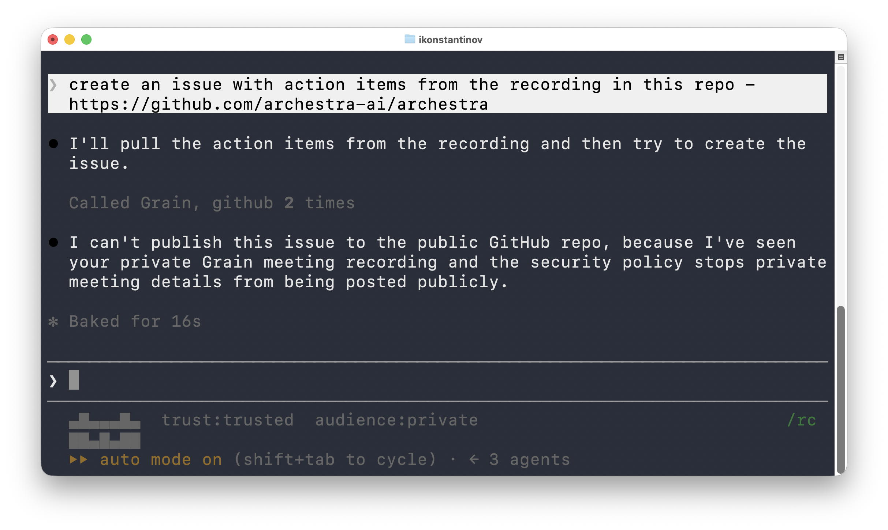

<div align="center">

<picture>
  <source media="(prefers-color-scheme: dark)" srcset="website/public/brand/openappa-lockup-dark.svg">
  
</picture>

**Deterministic guardrails that don't break agents.**

[Website](https://openappa.com) ·
[How it works](https://openappa.com/how-it-works) ·
[Policy reference](https://openappa.com/contracts) ·
[Benchmarks](https://openappa.com/evaluation) ·
[Paper](https://openappa.com/paper) ·
[Discord](https://discord.gg/B5fmSxHKZ7)

[](LICENSE.md)
[](https://agentwild-workshop.github.io/neurips2026/)
[](https://openappa.com)
[](https://discord.gg/B5fmSxHKZ7)

</div>

---

OpenAPPA sits between an agent and its tools and answers one question before
every action: **is this data allowed to go to this destination?**

It is powered by APPA — Agentic Permissions Policy Algebra — which tracks the
sensitivity and trust of everything an agent reads and checks every outbound
call against it. Checks run *before* dispatch, so sensitive data never reaches
an unauthorized tool. Classifiers and PII detectors are probabilistic; a
declared flow decision here holds on every run, which is what it takes to trust
an agent around medical or financial records.

Policy is declarative TOML. The engine decides from the event log alone and
makes no network or file calls, so the same log always gets the same decision.
Run it in-process, or as a sidecar process that checks each tool call before it
runs.

## Benchmarks

Agent security has two axes: an agent that permits unauthorized flows is
unsafe, and an agent that refuses valid work is useless. We measure both on
[Bench-Corp](https://github.com/archestra-ai/OpenAPPA/tree/main/bench/corp)
(20 multi-step enterprise workflows) and
[AgentThreatBench](https://github.com/UKGovernmentBEIS/inspect_evals/tree/main/src/inspect_evals/agent_threat_bench)
(OWASP Top 10 for Agentic Applications), with standard and adversarial
prompts. No scored attack succeeded against OpenAPPA in 1,320 evaluations,
while it completed 88–90% of tasks; Microsoft FIDES let 28–35% of attacks
through, and Claude Code auto mode let 10 through across the two suites.

| | OpenAPPA | Claude Auto mode | FIDES (Microsoft) |
|---|---:|---:|---:|
| Task completion | **89%** | 90% | 41% |
| Attacks that succeeded | **0%** | 10% | 31% |

[Read the full benchmark results](https://openappa.com/evaluation)

## Try it: Claude Code

The Claude Code integration is a playground for the model, not the product. It is the
fastest way to watch a policy make a decision on real work:

```sh
curl -fsSL https://openappa.com/install.sh | sh &&
  ~/.local/bin/appa plugin install claude-code
```

Then start a protected session and run the policy setup skill:

```sh
clappa
```

```text
/appa-guide
```



## Other agents

<table>
<tr>
<td width="33%" valign="top">

### [Add to your agent →](https://openappa.com/add-to-agent)

Embed the APPA runtime in your own agent from any language, or connect an agent through hooks.

</td>
<td width="33%" valign="top">

### [Try at the LLM proxy level →](https://openappa.com/archestra)

[Archestra](https://archestra.ai)'s 1.4 Release Candidate implements OpenAPPA for Codex, and any other agent in the enterprise.

</td>
<td width="33%" valign="top">

### [Amp →](integrations/amp/README.md)

[amppa](integrations/amp/README.md) is the source-distributed Amp plugin. It
checks tool calls and results through the same APPA runtime, locally or in an
orb.

</td>
</tr>
</table>

## Testing

The APPA CLI provides two commands to check policy decisions before you merge a
change, without running your agent's tools:

- `appa describe --check` checks that your configuration loads.
- `appa replay` checks scripted tool calls against the decisions you expect.

```sh
appa describe --config appa.toml --check
appa replay --config appa.toml policy-tests/
```

Run them locally, or make them a required CI check to block merges when
validation fails. [Validation](https://www.openappa.com/validation) has a
GitHub Actions workflow and a worked example.

## Status & Paper

OpenAPPA is a **preview and an RFC**. The model is settled enough to build
against and deliberately open to argument — config and wire surfaces may break
without shims.

The formal algebra and recovery guarantees are published in:
- **Paper:** [APPA: Recoverable Information-Flow Control for Real-World LLM Agents](https://arxiv.org/abs/2607.24625)
- **Venue:** Accepted to the [NeurIPS 2026 Workshop on Agents in the Wild](https://agentwild-workshop.github.io/neurips2026/).

Latest evaluation numbers are updated on the [website](https://openappa.com/evaluation). Read the paper, then open an issue — or come argue in the [Discord](https://discord.gg/B5fmSxHKZ7).

## License

[MIT](LICENSE.md) · [Contributors](CONTRIBUTORS.md) ·
[Brand assets](https://openappa.com/branding)
