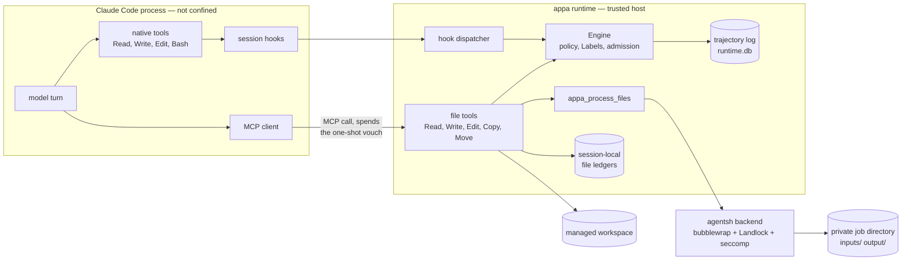
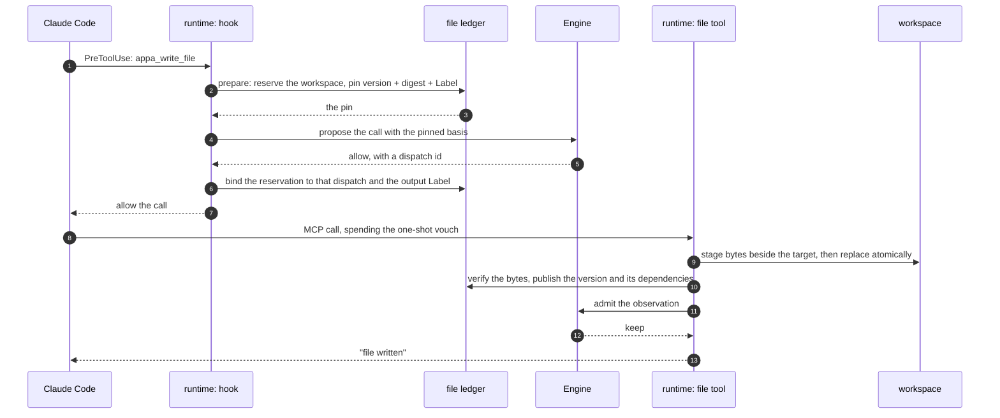
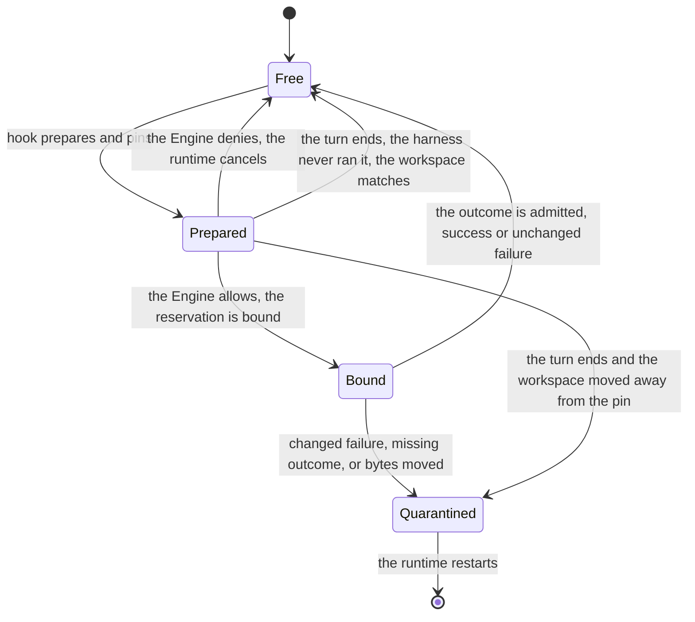
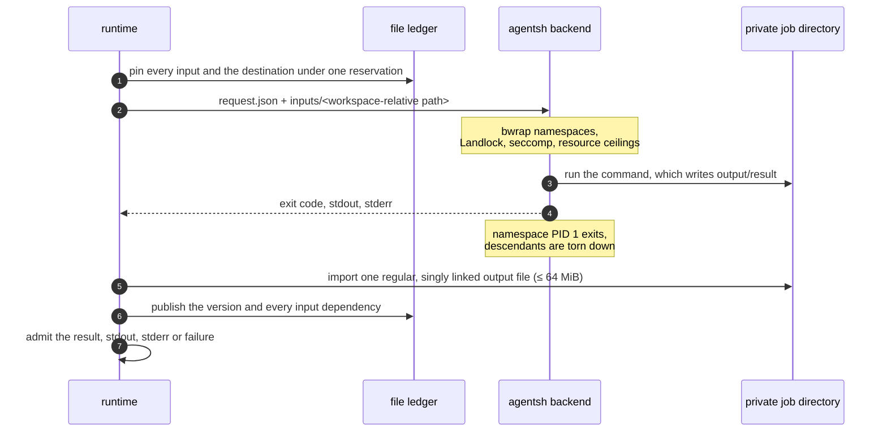

# File mediation

Runtime-owned file tools for a workspace the runtime owns: a session-local version ledger, Label
propagation through file operations, and opt-in isolated processing of declared inputs.

**Status: draft.** The file runtime is off unless the APPA configuration contains a
`[file_tracking]` table. Read [What is verified](#what-is-verified) and
[What is not covered](#what-is-not-covered) before relying on it.

Related documents:

- [Claude Code plugin README](../marketplace/plugins/claude-code/README.md) — install, the
  security scope, and the staged plan this document describes the middle of.
- [Isolated file processing](../integrations/agentsh/README.md) — the pinned agentsh backend:
  build, requirements, contract and acceptance probes.
- [appa-runtime README](README.md) — build, configuration and start for the runtime itself.

## Where to start

| If you want to… | Read |
| --- | --- |
| run it on a host | [Operating it](#operating-it) |
| understand why the runtime owns the file tools | [Why a hook is not enough](#why-a-hook-is-not-enough) |
| review the design | [How one call is checked](#how-one-call-is-checked) and [The ledger](#the-ledger) |
| judge the security claims | [What is verified](#what-is-verified) and [What is not covered](#what-is-not-covered) |
| find the code | [Where the code lives](#where-the-code-lives) |

## Why a hook is not enough

APPA checks flows at hook boundaries: the harness proposes a tool call, the runtime answers,
and the harness obeys. That works while the checked value is the call itself. A file
operation is different, because the value that flows is the file's content, and the hook
never sees it.

- A native Read returns bytes the runtime has not labeled. By the time the PostToolUse hook
  reports the result, those bytes are already in the model's context.
- A native Write's Label depends on the content it replaces, and nothing in the call says
  which version of the file the model read.
- Claude Code's own validation runs before `PreToolUse`. A 2.1.268 probe returned a
  content-dependent Edit match error with no APPA proposal, so a hook denial cannot prevent
  that observation.
- Hiding bytes behind an acknowledgement is not enough either: `Copy` and `Move` must carry
  the source's Label to the destination even though the model never sees the bytes.

The file runtime answers all four by moving the file operation itself behind the runtime.
The runtime reserves the workspace, pins the current version, digest and Label, checks the
call with that pinned basis, performs the operation on the pinned path, and records the
version it published. The model proposes paths and content; it never supplies a Label, a
version, or a trajectory identity.

## The parts



The workspace, runtime database, policy, and backend are host-owned state. The file ledgers
live only in runtime memory. The runtime never mounts the live workspace into an isolated command.

| Piece | What it owns |
| --- | --- |
| `hooks` and the MCP endpoint | the harness boundary: proposals, results, session lifecycle |
| `Engine` | the policy check, Label combination, and the trajectory log |
| file tools | the six runtime-owned tools and the reservation protocol |
| file ledger | one root session's versions, digests, Labels, dependencies, and reservation |
| agentsh backend | execution of `appa_process_files` under namespaces, Landlock and seccomp |

## How one call is checked

A write is the longest path, so it is the one worth following. `Read`, `Edit`, `Copy`, `Move`
and `Process` take the same shape with a different basis.



1. **Proposal.** The harness sends the tool call to the PreToolUse hook. The hook knows the
   actor; the MCP request that follows does not, because an MCP request carries no session.
2. **Reservation.** The ledger takes the one workspace reservation and pins what it finds:
   the path's current version, digest and Label, or "absent". Initialization and every
   `prepare` refuse symlinks, hard links and non-regular files, so a pin always names a
   regular file.
3. **Check.** The runtime builds the call's `FileBasis` from the pin and proposes the call
   with it. The basis is part of the proposal-batch identity, so the same rendered call over
   different content is a different act. The Engine checks requirements against the combined
   Label and records its basis on the dispatch.
4. **Vouch.** On an allow, the runtime records a one-shot vouch keyed by the canonical call
   (tool name plus RFC 8785 arguments) and binds the reservation to the dispatch. The MCP
   tool spends that vouch when it arrives, so a model that calls the tool without a
   preceding hook is refused.
5. **Execution.** The tool runs on the path the pin recorded, never on a second reading of
   the path the call spelled. A replacement is staged beside the target and atomically
   replaced. A `Copy` stages raw bytes; a `Move` uses a same-filesystem rename.
6. **Publication.** The runtime re-hashes the file and publishes an immutable version with
   its Label and content dependencies. Only then does the Engine admit the observation, and
   only then does the result reach the MCP caller. A successful mutation publishes a new
   version even when its bytes match the previous version: the version identifies the act,
   not the content.
7. **Result.** The PostToolUse hook that follows is absorbed: the runtime-owned tool already
   admitted its own observation. A harness that never runs the released call leaves the
   reservation behind, and the turn end gives it back only while the workspace still shows
   the pinned state.

An operation that does not complete cleanly — a changed failure, a missing outcome, a digest
that no longer matches the pin, an interrupted transfer — keeps the live reservation and
refuses every later file call in that workspace until an operator reconciles it. The
runtime never guesses.

## The file tools

The five direct file tools are advertised while file tracking is enabled.
`appa_process_files` is advertised only when `--file-process-backend` is also configured.
Paths are workspace-relative or absolute inside the workspace.

| Tool | Arguments | Returns to the trajectory | Publishes |
| --- | --- | --- | --- |
| `appa_read_file` | `file_path` | the file's bytes | nothing |
| `appa_write_file` | `file_path`, `content` | "file written" | a new version |
| `appa_edit_file` | `file_path`, `old_string`, `new_string` | "file edited" | a new version |
| `appa_copy_file` | `source_path`, `destination_path` | "file transfer completed" | a new destination version |
| `appa_move_file` | `source_path`, `destination_path` | "file transfer completed" | a new destination version and the source's absence |
| `appa_process_files` | `input_paths`, `output_path`, `command` | the command's result | a new version |

`Edit` matches `old_string` exactly once and refuses an empty match. The match happens after
the check, never before it. `Copy` and `Move` refuse a same-path transfer and a
cross-filesystem move, and both replace an existing destination: the destination's previous
content stays in history but does not taint the new bytes.

## Labels: two labels per call

Every call that touches a tracked file produces two different Labels. The distinction is the
reason the tools exist, and mixing them up is the easiest way to misread this subsystem.

- The **trajectory label** is what the call returns to the model's context. A `Read` carries
  the file's Label into the trajectory. A `Write`, `Edit`, `Copy` or `Move` returns a
  constant acknowledgement, so the content does not enter the trajectory — a later `Read`
  is what does.
- The **published file label** is what the call writes into the ledger as the Label of the
  new file content. A `Copy` or `Move` puts the source's Label there even though the model
  never sees the bytes.

| Operation | Trajectory label becomes | Published file label |
| --- | --- | --- |
| `Read` | trajectory ⊓ file | — |
| `Write` (new file) | trajectory ⊓ delta | trajectory ⊓ delta |
| `Write` (replacing) | trajectory ⊓ predecessor ⊓ delta | trajectory ⊓ delta |
| `Edit` | trajectory ⊓ predecessor ⊓ delta | trajectory ⊓ predecessor ⊓ delta |
| `Copy` / `Move` | trajectory ⊓ delta | trajectory ⊓ source ⊓ delta |
| `Process` | trajectory ⊓ delta | trajectory ⊓ every declared input ⊓ delta |

⊓ is [`Label::combine`](../appa-engine/src/label.rs): minimum trust, intersected audiences.
The tool's `delta` is its policy contract; a file call is checked with the same engine
machinery as any other call. Requirements are checked against the content that flows to the
destination, so a `Copy` into a restricted destination is refused on the source's Label even
though the acknowledgement never carries it. Failure text is admitted at the same value
Label a success would have used, so an error can never say more than the call it came from.

An `Edit` records the predecessor version as a content dependency. A `Write` records none:
replacement destroys content rather than deriving from it, so history is not a dependency.

## The ledger

The runtime keeps one in-memory ledger for each root session. A root trajectory and all child
trajectories use the same root ID to select it. Therefore, subagents share file Labels,
versions, receipts, and the live reservation. Another root session gets an independent ledger.

The first file operation in a root session scans the workspace. It gives every existing file
the operator-configured initial Label. The ledger then holds every published version, the
current version per path, one live reservation, and idempotent receipts for completed calls.
The map and every ledger are process-local. Restarting the runtime discards them.

Hashes verify bytes; they never classify them. Historical bytes are not retained, so a
version is a record of what was there, not a copy of it.

### The reservation lifecycle



A quarantined ledger refuses every later file call in that root session. The runtime cannot
tell an unrun call from one whose report was lost. It does not guess a Label for changed bytes.

## Isolated declared-input processing

`appa_process_files` runs a command that reads declared input snapshots and writes one
output file. It is enabled by `--file-process-backend`, which names a host-installed backend
built from [`integrations/agentsh`](../integrations/agentsh/README.md).



The live workspace is never mounted. Input mounts are read-only, the environment is cleared,
inherited descriptors are closed, and the syscall policy denies sockets, keyrings,
cross-process memory and signals, and namespace changes. Every result — output, stdout,
stderr and failure — carries the combination of every declared input's Label with the
receiving trajectory and the tool delta. Ignoring an input does not remove its contribution,
and no acknowledgement exemption applies to this tool.

The runner sets resource ceilings and refuses to start without them. The full table, the
launcher-failure contract and the acceptance probes are in the
[backend README](../integrations/agentsh/README.md).

## Operating it

```sh
appa runtime --config /host/file-policy.toml --db /host/runtime.db \
  --file-process-backend /host/backend
```

- The `[file_tracking]` table in `file-policy.toml` is the feature flag. Omitting it disables
  file tracking. A complete table supplies `initial_trust` and `initial_audience`.
- Each root session binds to the `cwd` in its first file call. Its subagents share that
  workspace and ledger. Another root session can bind to a different workspace.
- The initial settings classify each root session's initial snapshot. They do not inspect
  content. The policy separately defines which file-tool flows are permitted.
- A snapshot refuses a workspace that holds any symlink or hard link. Use a dedicated directory.
- Keep the policy, runtime database, and backend outside the workspace.
- The policy must name all six file tools. A tool the policy does not name is refused, not
  annotated.
- The policy must not use sanitizers or rewrite routes. File tracking refuses to start when
  the registry holds any, because a rewritten call would render arguments the ledger never
  pinned.
- In file mode, APPA admits declared subagent spawns so children can use the root ledger.
  Every other call that reaches APPA and is not one of the six file tools is refused,
  including APPA's own management tools. Run those from the `appa` command line.
- One file operation runs at a time per root session. A root and its subagents share that reservation.
- `appa claude-files` is a separate constrained test launcher: it removes the native tools,
  starts Claude in a private empty directory, and serves the file tools over private stdio
  bound to a host-assigned trajectory. It is an experimental test path, not required by the
  plugin install.

`file-policy.toml` is an ordinary APPA policy, not a second initial classification. Its
file-tool contracts define the flows that the Engine permits after the snapshot has Labels.
For example, this minimal policy permits all six mediated operations without adding a tool
delta or requirement:

```toml
[policy]
version = 2

[file_tracking]
initial_trust = "suspicious"
initial_audience = "public"

[[policy.tool]]
name = "mcp/appa/appa_read_file"
delta = {}

[[policy.tool]]
name = "mcp/appa/appa_write_file"
delta = {}

[[policy.tool]]
name = "mcp/appa/appa_edit_file"
delta = {}

[[policy.tool]]
name = "mcp/appa/appa_copy_file"
delta = {}

[[policy.tool]]
name = "mcp/appa/appa_move_file"
delta = {}

[[policy.tool]]
name = "mcp/appa/appa_process_files"
delta = {}

[[policy.tool]]
name = "host/claude-code/Agent"
delta = {}

[policy.deployment]
context_control = true
```

Add `requires` or a non-empty `delta` when the deployment needs tighter file flows. The
`initial_trust` and `initial_audience` settings only Label bytes that exist when a root takes
its snapshot; they do not replace these contracts.

## What is verified

Unit and integration tests cover the mediated contract, not the unmediated paths around it:

| Area | Covered by |
| --- | --- |
| Hook binding, duplicate results, and root-session isolation | `managed_files_plugin_hooks_bind_exact_calls_and_absorb_duplicate_results` |
| Subagent sharing and root-workspace isolation | `file_ledgers_are_shared_by_subagents_and_isolated_across_root_workspaces` |
| Label combination for Read/Write/Edit, restart and reopen | `managed_files_read_write_edit_and_restart_use_engine_labels`, `managed_files_bound_caller_retains_failure_taint_after_reopen` |
| Check-before-match, admitted failure text | `managed_files_owned_execution_checks_before_matching_and_admits_errors` |
| Copy/Move Labels without payload admission | `managed_files_copy_move_bypass_payload_admission_but_preserve_labels` |
| Pinned path execution | `managed_files_execute_the_pinned_path_not_the_argument_path` |
| Quarantine and release | `managed_files_failures_quarantine_only_the_live_session_ledger`, `managed_files_release_a_released_call_the_harness_never_ran` |
| Process Labels and dependencies | `managed_files_process_results_and_failures_keep_input_labels` |
| In-memory ledger invariants and store isolation | `appa-eventlog/src/files.rs` unit tests |
| Isolation: allowed processing, input immutability, control files, sockets, keyrings, inherited descriptors, parent memory, descendant teardown, the process ceiling | `integrations/agentsh/test_live.py` on a built backend |

Live Claude Code 2.1.268 exercises through the installed plugin — run by hand, not part of
the automated suites — cover Read/Write/Edit with narrowing, Copy/Move without a Read,
overwrite and refusal cases, a two-input invoice calculation that persists both dependency
edges, denied control-file, network and input-write attempts, symlink publication refusal,
and restart behavior under a fresh session ledger.

## What is not covered

- **The Claude Code process.** This isolates APPA Process commands, not the harness. Native
  tools keep running in Claude; their calls that reach APPA are refused, but native
  pre-hook validation and implicit reads (project instructions, memory) happen before any
  hook. `claude-files` removes them for its own test path only.
- **Inference.** Requests to the model provider and the final response are not mediated.
  A proxy that gates provider traffic is a documented future extension, not part of this
  work.
- **Arbitrary subprocesses.** Only `appa_process_files` runs isolated. Shell `cp`, `mv` or
  any other command a model might run is not mediated, because native Bash is refused
  rather than confined.
- **Precise dependencies inside a program.** Process Labels are conservative: every declared
  input contributes whether or not the command read it.
- **Declassification.** No sanitizer or rewrite policy is supported in file mode, and no
  operation lowers a Label.
- **Restart persistence.** File versions, Labels, receipts, and reservations do not survive
  a runtime restart. A reopened trajectory gets a fresh ledger from the current workspace.
- **Metadata and timing flows, resource exhaustion, kernel vulnerabilities.** Resource
  ceilings bound cost rather than eliminate it.
- **Writers outside the runtime.** The design assumes no process outside the harness edits
  the workspace, and the backend and system toolchain are trusted, public host input with no
  credentials or private data.

## Where the code lives

| Path | Contents |
| --- | --- |
| [`src/api/files.rs`](src/api/files.rs) | the six tools, the reservation protocol, execution and admission |
| [`src/api/process.rs`](src/api/process.rs) | the staged-input contract and output import |
| [`src/claude_files.rs`](src/claude_files.rs) | the constrained launcher and its private stdio server |
| [`../appa-eventlog/src/files.rs`](../appa-eventlog/src/files.rs) | the in-memory version ledger |
| [`../appa-engine/src/value.rs`](../appa-engine/src/value.rs) | `FileBasis`, the two output labels |
| [`../appa-engine/src/check.rs`](../appa-engine/src/check.rs) | requirement checking over a resolved call |
| [`../integrations/agentsh`](../integrations/agentsh) | the pinned, patched isolation backend |
