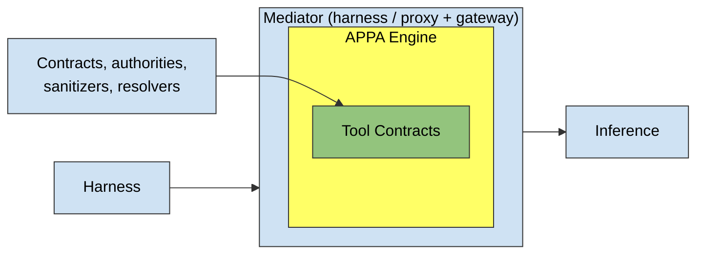

# APPA: Agentic Permissions Policy Algebra — Specification Draft

**Status: draft.** This document describes the APPA model for engineers
building agents and integrations. It is self-contained: no background in
security theory is assumed. A companion paper covers the formal foundations.

## Overview

APPA is a policy engine that sits between an AI agent and its tools. Every
tool call the agent proposes is checked before dispatch. It tracks where
information came from and decides whether it may flow into tools and external
recipients.

APPA never works via guardrails or other imperative techniques. It is
declarative: it infers the run's state from the run itself and checks it
against registered tool contracts and authorities — the only sources of truth
for its decisions. Everything reduces to comparisons against exactly two
pieces of state:

- the **label** — travels with the data and is *checked*. It answers "what is
  this information: who may read it, how trusted is it."
- the **log** — travels with the run and is *informational*: an append-only
  record of what happened — world events, rulings, confirmations.

Nothing else carries state. Anything imperative — an approval flow, an ML
model that vets content, a lookup that resolves a recipient to a set of
readers — lives in components registered with the engine, never inside it.
External identity machinery (OAuth, SAML) does not belong to APPA; it trusts
those inputs.

## Where APPA runs

APPA is a small kernel, framework-agnostic, but not free-floating. The engine
must **see the full trajectory** and **control tool execution**. That pins
where it can live:

- the harness itself;
- an inference proxy paired with a tool gateway;
- an inference proxy alone, if it intervenes in the model's output
  aggressively enough to stop a call.

A pure MCP gateway cannot host it: it sees tool calls but never the
trajectory that labels them. Product-wise this is a feature, not a
constraint — unlike naive rule-based approaches, APPA sits where the context
is, and is exactly as smart as the context it holds.

One capability further divides deployments: a layer either can hold a raw
tool result out of model context — run the call, keep the bytes back, surface
a sanitized derivative or nothing — or it cannot. Call a deployment that can
**confining**. The capability is just that — holding bytes back; the
confinement constructions (quarantined branches, compiled composites) are its
consequences, and exist only in confining deployments, because once the agent
has observed a value, it is in its context for good. Checks and label
propagation hold everywhere.

### Architecture



- **Blue** — not part of APPA. This spec describes how to integrate it;
  example implementations exist.
- **Yellow** — APPA itself: the label arithmetic, the log, the checks.
- **Green** — the interface you configure APPA through: tool contracts and
  registered externals (authorities, sanitizers, resolvers).

The mediation loop, on each round-trip: the run's turns accumulate into the
trajectory; every tool call the model proposes is checked before dispatch; an
allowed call runs and its declared contributions land (label delta and world
events); a blocked call never runs — the model receives the exact failed
predicates and the available remedy plans instead, and can execute a plan by
id (see The check).

## What APPA protects against

- The agent is **benign but confusable**: it can be steered by injected
  instructions, but it is not itself adversarial. A malicious model
  constructing covert channels — encoding secrets into its choice of
  actions — is out of scope.
- Malice enters **exclusively through content labeled suspicious** (or
  Unknown, until resolved). Content labeled trusted — including internal
  systems of record — is trusted by definition; APPA offers no protection
  when a trusted source is malicious, just as no policy survives a malicious
  operator.
- Authorities, sanitizers, and dynamic resolvers — and their
  **configuration** — are the deployer's trusted base. A YOLO configuration
  (auto-approve authorities, automatic Unknown → trusted casts) is legitimate
  and voids the corresponding guarantees explicitly and auditably; that trade
  is the deployer's to make.
- APPA assumes a **serialized, durable event log**. Crash-atomicity of event
  recording and concurrency between branches are the host's obligations, not
  the engine's; history checks are sound per-line, not globally, in the
  presence of concurrent branches.
- The core trajectory is **linear**. Branching is a host capability governed
  by the confinement profile (below); its guarantees hold only in confining
  deployments.
- Deployment realities — approval UX (approval fatigue is the real attack
  surface of any human-in-the-loop scheme) and bootstrapping
  contract/sanitizer coverage — are adoption concerns, out of scope here.
  APPA is exactly as good as the authorities and contracts registered into
  it.

## The data model

All data flows as a `LabeledValue`. Value and label are never separated and
never operated on directly.

- **value** — an agentic turn: tool call + result, a part of the trajectory.
  The natural unit of existing agentic workflows.
- **label** — who may read this information and how trusted it is: the
  product of the two label dimensions.
- **label delta** — what running the tool would bring into the trajectory
  label, affecting all next steps. Contracts declare it as `delta`.
- **label requirement** — what the trajectory label must satisfy before a
  tool may run. Contracts declare it as `requires`.

Tool calls are transactional: once a tool runs, its delta is folded into the
trajectory. Sanitizing after the fact cannot clear a trajectory.

## Labels

The label has exactly two dimensions, **fixed in shape, configurable in
instance**. Configuration is data — an ordered list of names, a family of
sets — never code.

### Trust

A finite ordered chain of ranks. The default instance is
`suspicious < trusted`; a deployment may supply its own, e.g.
`unvetted < vendor < internal < reviewed < verified`.

An unreviewed read contributes the *minimum*: one suspicious value makes the
whole trajectory suspicious. A ruled endorsement contributes the *maximum*,
up to the ruling authority's ceiling. A tool requiring rank `r` accepts
anything at or above `r`.

### Audience

A set of readers drawn from a fixed per-deployment universe, with named,
possibly nested groups; `public` means the whole universe. A customer's
secrecy taxonomy embeds as nested groups
(`level-3-readers ⊂ level-2-readers ⊂ everyone`) — classification schemes
are audience *configuration*, not a new dimension.

Reader sets are symbolic — domains, named groups, explicit id-lists.
Containments among named groups are configuration the engine decides as
data; membership of a raw id (`john ∈ hr`) is a dispatch-time question for a
registered **resolver**. A ruling naming a group binds the group
symbolically: every check resolves membership fresh at decision time — a
removed member is excluded from all later checks, but nothing looks back
between checks; mid-flight revocation is the directory's concern, not the
engine's.

Reading restricted data **shrinks** the reader set (intersection: only
people cleared for every input may read the combination); widening it is
only ever an explicit ruling. A tool's requirement can constrain the reader
set from either side:

- a **cover** — the trajectory's readers must include the concrete
  recipients the call would expose the data to;
- a **source-protecting bound** — the readers must stay *inside* the tool's
  declared set: "do not fetch me into a context outsiders can read."

### How the label moves

A contract's `delta` describes what dispatching the tool does to the
trajectory label:

- A read contributes the *restrictive* move: intersect the audience, take
  the minimum trust.
- A ruled raise contributes the *permissive* move: add readers, or raise
  trust up to the ruling authority's ceiling. The raising delta attaches to
  the very call that was approved — it is still the tool call bringing its
  delta, never an ambient state change. (And it only happens in the
  explicitly requested *epoch-wide* variant; the default ruling never
  touches the label at all — see Rulings.)

Order matters, deliberately. A restricted read *after* a raise re-narrows
the label and **evicts previously approved readers not entitled to the new
content** — anyone who survives the intersection is, by construction, in the
new data's own reader set.

Two useful consequences fall out of this shape. Without raises, the label
only ever moves down, and settles — no oscillation. And the engine never
needs to replay a run to compute its label: the whole history of audience moves
collapses to a keep-set and an add-set — the pair is the balance, the moves
are the transactions.

Any value the agent authors after observing restricted data carries the full
trajectory label — the agent's output is an unbounded channel, and assuming
anything narrower would be unsound. (A planned future extension: an argument
passed provably by reference — byte-identical to a stored pre-exposure
value, never retyped by the agent — may keep that value's own label. Not in
v1.)

## The event log

Everything historical lives in a single append-only log. Nothing about it is
ever checked before appending: history is recorded, not approved. Two
species of events share it:

- **World events** — what the run did outside: `egress`, `mutation`, drawn
  from a configurable vocabulary. Declared by contracts as `emits` and
  appended at dispatch — one append point, deliberately. Dispatch-append is
  fail-closed where it matters: for `no_prior(egress)`, the *attempt* is on
  the record even if the call then fails — the email may already be in
  someone's inbox. The honest flip side: a positive `prior(k)` proves the
  dispatch happened, not that the outer world succeeded — name events
  accordingly (`backup_dispatched`, not `backup_succeeded`);
  outcome-sensitive completion events are future work.
- **Governance events** — what was decided: authority rulings and the
  dispatches that consume them, boundary events, sanitizer applications,
  Unknown casts. A **boundary event** is not a decision — it is punctuation:
  a mark in the log that pending rulings cannot outlive. The engine appends
  one at the end of each assistant turn, at fork, and at merge.

The log is consulted in exactly three ways: **history requirements** in
contracts, **ruling validity** (rulings, their consumption, boundaries), and
audit. Useful summaries — e.g. "the set of world-event kinds seen so far" —
are views computed from the log, cached by the engine, never independent
state.

The typical pattern — a convention, not a rule: integrity via trust floors
on mutating tools, confidentiality via audience covers on publishing tools;
any contract may combine any requirements. World events *record occurrence*
and support history requirements; the gating itself is always the label's
job.

World events are also the model's sanctioned pressure-release valve —
deliberately. A deployment can encode almost any bespoke gating ritual as
event vocabulary plus a dynamic authority: a `finance.spend` event whose
accumulated magnitude — a log view, summed by a registered authority —
decides between auto-approving and paging a human. That is better than the
alternatives: the hack is a named event in an auditable log, not a
distortion of the label rules, and the guarantees on everything else stand.
(Budget as a label dimension is deliberately out of scope; a deployment
whose event vocabulary sprawls is signaling it wants a workflow engine on
top, not a bigger policy engine.)

## Tool contracts

A contract declares one contribution per piece of state — `delta` for the
label, `emits` for the log — plus `requires`:

- **`delta`** — the label action. Checked *before* it is applied: the state
  the call would commit must pass, so a delta can be blocked, remedied, or
  require a ruling.
- **`emits`** — the world events the dispatch appends, an unordered batch
  recorded as one step. Applied, never checked: you cannot fail an append;
  history is not up for approval.
- **`requires`** — in two kinds:
  - **label requirements**, checked against the trajectory label: a trust
    floor (`trust: trusted`), an audience cover (`audience ⊇ recipients` —
    the recipient set derived from the actual arguments via placeholders, or
    declared statically), a source-protecting bound (`audience ⊆ C`,
    optionally `strict` — see check timing).
  - **history requirements**, checked against the log, in three species:
    - `no_prior(egress)` — no matching world event in the log. Not consumed
      by checking; waivable for one dispatch by a ruling whose issuer's
      mandate covers the waiver.
    - `prior(backup_ran)` — a matching world event exists ("delete the
      database only after the backup ran"). Nothing to waive — the remedy is
      to make the event happen. (With dispatch-append this proves the backup
      was *dispatched*, not that it succeeded — name events accordingly.)
    - `confirmed_by(A)` — this dispatch carries A's ruling: A is an
      authority whose mandate covers confirming this tool, ruling on the
      exact rendered call — tool plus resolved arguments; confirming
      `transfer(A, $1)` must not authorize `transfer(B, $100)`. Delivered
      like every ruling — inside the atomic plan execution under Rulings —
      so approval and dispatch coincide: one ruling admits one dispatch, and
      a repeat takes a fresh one.

Contracts can be static, static with placeholders, or dynamic. A placeholder
contract:

```
tool: send_email(to: $recipient)
requires:
  trust: trusted
  audience: {$recipient}
emits: {egress}
```

Naive placeholders do not solve real-world ACLs, so delegating resolution
(recipient → reader set) to external services is a legitimate choice for
complex deployments. Such dynamic resolvers must be registered in advance;
like sanitizers, they are trusted components.

Two surface conventions, both presentation rather than model. Contract
language leads with `requires` — a delta reads best as a stated consequence
(`read_hr: makes the conversation HR-only`); "this tool changes the label"
is the expert's view of the same fact. And source deltas are derivable: a
dynamic resolver mapping a document to its ACL's reader set auto-generates
`audience ∩ readers(doc)`, so humans hand-write the sinks they care about
and inherit the sources for free. The two slots stay distinct underneath — a
delta is what the run *learns*, a requirement is what the run *exposes*; a
send changes nothing the trajectory holds, and a read must be allowed *and*
taint. Unify the surface, never the slots.

FixMe: the concrete contract-definition format is an open question — still
to be defined; the examples in this document use the notation above.

## The check

Before every tool call the contract is evaluated. The outcome is binary —
allow, or block with the exact failed predicates. The check itself is
two-fold:

**1. Tool requirement compatibility.** Never widen the audience, never act
on worse trust than the tool requires: the trajectory label satisfies the
contract or the call is blocked. Where the required audience comes from
placeholders, it is derived from the actual arguments — the trajectory's
readers must cover the concrete recipients of *this* call; a static contract
simply declares its recipients.

**2. State acquisition.** Do not touch more secrets than the task really
needs. Every unruled contribution moves the label down or leaves it in
place — on both axes, no exceptions; a raise is the only up-move, and it is
ruling-carried by construction. A call whose committed state would strictly
descend is deliberately soft-blocked; a repeat that leaves the state
unchanged is not. The point: committing to restricted data voluntarily
shrinks the **release frontier** — what the agent may still release, and to
whom, without a further ruling. APPA makes that a conscious, remediable
choice *before* the data is fetched, instead of a silent ratchet discovered
three steps later.

A single call never mixes the two directions: a raise and a narrowing are
always two transitions, rendered and checked separately. A tool that both
reads restricted data and releases it (`share_doc(doc, outsider)`: fetch,
then grant access) is a composite of the two — so the check always faces a
pure descent or a pure raise.

Together the two checks are a pragmatic middle ground between the two
failure modes of agent security: YOLO agents that ingest and leak
everything, and hard-restricted agents that cannot do anything useful.
Check 1 makes the dangerous flows impossible; check 2 makes the restricting
ones a deliberate, remediable choice.

The central thesis: **down is free, up needs authority** — and APPA asks the
agent to choose between preserving its release frontier and entering a
restricted context *before* fetching the data. The soft block shifts the
reasoning left. Spelled out: a requirement that fails because the state is
too *low* — an uncovered recipient, an unmet trust floor — is cured only by
a ruled raise or a ruled release; no sequence of unruled steps can ever cure
it, because unruled steps only descend. A requirement that fails because the
state is too *high* — a source bound with outsiders in the context — is
cured by narrowing: free, modulo the deliberateness stop. ("Free" means no
security power is exercised — not frictionless.)

### Check timing

Two clocks for two questions:

- **Label requirements** evaluate on the state the dispatch would *commit* —
  the current label with the call's own delta applied. Checking the current
  state instead would let a call outrun its own consequences. The attack:
  `search_and_share` with `requires: {audience: public}` and
  `delta: {audience: internal}` — on the current state the label is still
  public and the call passes, but the bytes it shares *are* the internal
  data its own dispatch commits. (A raising component in the delta is
  admissible only when carried by an explicit epoch-wide ruling.)
- **History requirements** ask what has already happened: they evaluate on
  the log as it stands at check time — so a call's own `emits` can never
  trigger its own precondition.

Source-protecting bounds (`audience ⊆ C`) default to the committed state: a
read that itself narrows into the bound passes, surfacing as the standard
state-acquisition soft block ("this fetch evicts these readers"), and the
evicted readers provably receive no post-read content. A requirement may
declare `strict`, additionally bounding the *current* state: the clean room
must already exist before the fetch — the narrowing that establishes it is a
separate, deliberately accepted prior step, never smuggled in by the fetch
itself. (Deployments whose channel physically shows every message to fixed
readers regardless of the label are out of scope: APPA governs agentic
trajectories, not generic channels.)

The delta commits and the events append only when the tool actually runs.

### Remedy plans

A block carries `remedy_plans`: the sound remedies available under the
current configuration and deployment capability (a confinement plan exists
only in a confining deployment). Plans are executable objects, not prose:
each carries an id, and the engine exposes **one agent-facing tool for all
of them, present from the start of the run** — `execute_remedy_plan(plan_id)`
— so the tool set stays stable (injecting tools mid-conversation breaks
prompt caches). The id, the ruling, and the dispatch all land in the log.

```ts
type CheckOutcome =
  | { outcome: "allow" }
  | { outcome: "block"; failed_predicates: Predicate[]; remedy_plans: RemedyPlan[] };
```

FixMe: open question — a `confirmed_by(A)` on an otherwise-passing call is a
*demanded* predicate, not a failed one; whether it surfaces through this same
block shape (and under what name) is unresolved.

Two facts about the list:

- **Nonempty is the weak direction**: a plan *exists* relative to the
  registered configuration and, where dynamic resolvers contribute, their
  answers at check time; succeeding still takes the authority granting and
  the world cooperating.
- **An empty list is a proof, not a shrug.** The remedy space is finite and
  enumerable from the registry: the ruled raises whose declared mandate
  covers the gap; the sanitizer-backed composites that would produce an
  admissible relabeled value (confining deployments only); for a failed
  `prior(k)`, the registered tools whose `emits` include `k` — the plan is
  to make the event happen; for waivers and confirmations, the declared
  mandates that cover them. For release-side failures nothing outside that
  enumeration can ever cure the gap, because unruled steps only descend. The
  agent provably should not spend turns on an unliftable restriction.

FixMe: open question — the shape of a `prior(k)` plan: making the missing
event happen means dispatching a *different* tool, so the plan spans two
transitions (the event-minting call, then the original one); whether both run
inside one plan execution, each under its own check, is unresolved.

## Rulings

Authorities are the single home of judgment in APPA — every act of human or
policy discretion is an authority **ruling**, one format, appended to the
log. An authority never rewrites the label directly.

Every ruling admits a specific pending call, and the default scope is **one
dispatch**: the approval covers exactly the engine-rendered call it names —
tool plus resolved arguments, never the agent's paraphrase — and **the label
does not change**. The release is recorded where run history belongs: the
ruling and the world event land in the log, while the label keeps describing
what the data *is*. A widening that genuinely should persist — an ongoing
external thread, many sends under one review — is the explicitly requested
variant: an **epoch-wide raise**, whose raising delta is part of the
rendered call (including its composition order with the call's own delta —
never ambient) and is reviewed by the authority over the trajectory state's
provenance, not one request. Later unruled reads re-lower it: a restricted
read evicts added readers not entitled to the new content, a fresh
suspicious read re-lowers trust; raising again takes a fresh ruling.

FixMe: open question — how the epoch-wide variant is "explicitly requested,"
and by whom: a contract annotation, a second plan offered alongside the
call-scoped one in `remedy_plans`, or harness configuration.

### Atomic plan execution

The mechanism is the remedy plan, and it is **atomic**. Executing a plan is
one indivisible step on a suspended line: the engine renders the call, puts
it to the authority — with provenance, never value bytes — and on approval
dispatches it; the plan id, the ruling, and the dispatch land in the log
together. Consequences, by construction rather than bookkeeping:

- nothing can intervene between approval and dispatch;
- an approval cannot cover a swapped call — it names the rendered call;
- an approval cannot be replayed — it is consumed by the dispatch it
  admitted; one review is one review, a repeat takes a fresh ruling;
- everything stays reconstructible from the log alone.

No grant object appears in configuration or on any wire: the public
vocabulary is **mandates**, **rulings**, and **log records**.

### Mandates

There are no ruling kinds at runtime. One engine rule instead: **a call
dispatches iff every failed or demanded predicate, and every raising
component of its rendered delta, is covered by the ruling that admits it —
and the ruling's issuer's mandate covers what was admitted.** The typology
lives where typology belongs — in **mandates**, declarations of what an
authority's ruling may cover:

- an **acquisition block** — admitting the descent the state-acquisition
  check stopped;
- a **raise up to a ceiling** — covering the raising component of an
  explicitly requested epoch-wide call (adding readers, or endorsing trust
  up to a rank — e.g. a human reviewed the fetched page and ruled the
  content safe). The default call-scoped release never needs this coverage:
  it widens nothing;
- a **named waiver** — covering a failed `no_prior` for the admitted
  dispatch only;
- a **confirmation of named tools** — `AttentionOncallSRE` confirms
  production-ops tools, `AttentionCTO` confirms enabling new AWS features,
  and the end user is simply the default confirming authority the harness
  registers. `confirmed_by(A)` is a requirement demanding A's ruling even
  when nothing fails. Deliberate consequence: a single ruling by A over a
  call satisfies both a soft block and a `confirmed_by(A)` on the same
  call — one review is one review; a deployer who wants two eyes names two
  authorities.

One structural bar concerns the assistant's own reply to the user (the
response sink): when the trajectory is restricted enough that even showing
content to the user is a release, that release takes a *distinct*
authority's ruling — **no ruling issued by the end user may cover any
predicate or raising component of a response-sink release**, whatever
mandate the user otherwise holds. The user cannot self-approve seeing
restricted content: the approval request would arrive on the very channel
being released, and an in-band self-confirmation is structurally not a check
at all.

FixMe: open question — the response sink's mechanics are otherwise
unspecified: what contract governs the assistant's reply, and how it enters
the same check pipeline.

Authorities can be automatic (up to auto-approve-everything) but stay
explicit: ML model, LLM-as-judge, regex, human in the loop, oncall page —
the implementation is up to you. Metaphorically, remedies are fine-grained
sudo — and with call-scoped defaults, sudo in its honest sense: one command,
one elevation, nothing ambient afterwards.

### Sanitizers and Unknown casts

Two further powers produce values and labels rather than admit calls:

- **Sanitize** — a registered transformer derives a new value under the
  label its mandate authorizes; the raw source keeps its own label and stays
  confined. Sanitizers apply to **tool results only**: never to the
  trajectory (once the agent observed a value it is in its context for
  good), and never to outgoing arguments — an input sanitizer would fire
  after the sensitive value already entered the context, i.e. after it
  leaked; shaping arguments is the agent's job, and a task that needs both
  an exact and a redacted view of the same data is a branching construction,
  not a sanitizer feature.
- **Resolve an Unknown** — cast an unresolved dimension to a concrete state,
  making the value usable (see Unknown below).

A sanitizer's mandate binds it to the transition it may claim
(`remove_pii`: audience internal → public); without mandates any registered
function could assert any label drop and the trust boundary would be
invisible to audit. A mandate binds a transition, not the information it is
claimed over — `remove_pii` is a sound remedy for CRM tickets and a
laundering machine for data that is all PII; scoping mandates by information
type is explicit future work. Registration is a trust decision about the
sanitizer, not a verification of its output.

### Why remedies are safe to hand to the agent

The engine soft-blocks anything that does not pass as-is and suggests remedy
plans built from the available authorities. Two invariants make that safe
even when the agent may already be steered by injected content:

- **Remedy-set soundness.** Every suggested plan is individually sound, so
  *which* plan the agent picks is security-irrelevant. Selection immunity
  comes from plan soundness, not from policing the selector.
- **Canonical rulings.** Authorities rule on the engine-rendered call plus
  provenance, never on the agent's paraphrase. A steered model summarizing
  "may I email the compliance archive?" while omitting that the address is
  attacker-derived is the remaining social-engineering channel; rendering
  the exact checked call closes it.

### Compiled composites (confining deployments)

A multi-step plan (e.g. confined acquisition feeding a sanitizer) is not
handed to the agent as steps — it is the same `execute_remedy_plan` object
with a body. In confining deployments the engine **compiles the plan into a
composite**: one synthesized invocation whose `requires` are the plan's
entry conditions plus a `confirmed_by` on the plan's authority, and whose
ordered body is part of the rendered object the authority rules on — so the
plan's approval covers its enumerated internal steps, and the internal soft
blocks find their ruling.

- The body executes step-by-step inside the confining layer, each step
  checked against the evolving internal state, intermediate values never
  surfacing.
- The composite's label `delta` is the *returned value's* contribution
  (intersect readers, min trust) — not the raw composition of the steps'
  deltas, which would be wrong in both directions: over-tainting the parent,
  or applying an internal sanitizer's raise to it.
- Execution is two-phase: the outer check runs against a declared bound on
  the result's label; the body executes while the confining layer holds the
  result; the actual result label is then checked against the bound, and the
  value commits only if it passes — otherwise it is discarded, while the
  executed steps' events stand.
- `emits` append per step, as steps actually run: a mid-body failure halts
  the composite with the executed prefix standing honestly in the log —
  never events that did not happen. No undo is promised; compensating
  stranded world effects is the deployer's affair, and plan-approving
  authorities rule knowing that.

Approving a plan is thus an ordinary confirmation of one rendered
invocation, and the agent cannot cherry-pick steps — it never holds them. A
non-confining deployment cannot compile composites: it can check and block,
but it cannot withhold. That is its documented trade.

## Worked example

Two similar tasks:

- **Task A** — get a ticket from an internal CRM and send it to an external
  auditor's email.
- **Task B** — get a ticket from an internal CRM and file a ticket in a
  public issue tracker.

```
get_ticket_from_crm:
  requires: { trust: trusted }
  delta:    { audience: internal }

send_email(to: $recipient):
  requires: { trust: trusted, audience: {$recipient} }
  emits:    { egress }

file_github_ticket:
  requires: { trust: trusted, audience: public }   // we never post things that are not public
  emits:    { egress, mutation }
```

Registered: `remove_pii` — a sanitizer with mandate audience
internal → public (barely working in practice, fine for the example) — and
`human_in_the_loop_approver`, an escalation authority.

The trajectory starts at the neutral, least restrictive label
`L0 = {audience: public, trust: trusted}` and an empty log (the default
starting label is engine configuration).

**The fetch.** `get_ticket_from_crm()` would fold in `audience: internal`.
This leaks nothing — the stop is needed because committing to internal
voluntarily shrinks the release frontier: what the agent may still release,
and to whom, without a further ruling. The engine soft-blocks and suggests
remedy plans:

1. run `get_ticket_from_crm` through `remove_pii` as a compiled composite
   (confined; needs a confining deployment) → the sanitized value
   contributes a neutral delta, the label stays `L0`;
2. `human_in_the_loop_approver` accepts the restriction →
   `L1 = {audience: internal, trust: trusted}`.

Under plan 1 the raw ticket never joins the agent-visible trajectory: only
the sanitizer's output crosses the boundary.

**Task B** after plan 1: `file_github_ticket(ticket)` requires audience
`public` — compatible; the dispatch appends `{egress, mutation}` to the log.

**Task A** after plan 2: `send_email(ticket, auditor_email)` derives its
required audience from the actual argument: the readers must include the
auditor. Under `L1` they do not — so this is a **second, distinct ruling**:
accepting the restriction never implies permission to disclose. The default
is call-scoped: the plan puts the rendered send to the approver and
dispatches on approval — the `egress` event and the ruling land in the log,
the label stays at `L1`, and disclosing a second ticket takes its own
ruling. A deployment expecting a long auditor exchange may instead request
the epoch-wide widening `∪ {auditor}`: `internal ∪ {auditor}` covers
`{auditor}`, the send passes by plain arithmetic, and the trajectory then
sits at internal + auditor — until the next `get_ticket_from_crm()`, itself
a fresh narrowing (a fresh soft block), folds `∩ internal` and evicts the
auditor. While that widening is in effect, only a `strict` source bound
(`readers ⊆ internal`, checked on the current state) would refuse a fetch
outright — the default lets the fetch itself do the evicting.

A smart agent chooses the right remedy from the task as early as possible —
the soft block shifts the reasoning left.

## Branching (the confinement profile)

The core trajectory is linear. A host that branches — subagents, quarantined
fetches, metatools — must implement this profile, or must not let branch
results cross back. It is the primary composition mechanism; the compiled
composites above are the engine-owned instance of the same semantics.

- **Fork.** The child starts at the parent's *current* label — never at the
  neutral `L0`: a fresh-slate child could "summarize what we know" into a
  public label, a laundering primitive. The child appends to the same shared
  log; the parent's history is simply its prefix. A fork appends a boundary
  event — which is why nothing pending survives into either line: an
  in-flight ruling finds the boundary and dies; no special rule needed.
- **Merge.** Two things come back, each in its native way:
  - The **returned value** is data: the parent absorbs its label like any
    other read — intersect readers, min trust. A widening active inside the
    child is structurally incapable of crossing back: intersection cannot
    add readers.
  - **History needs no merging at all**: there is one shared log, and every
    line appends to it in realtime. An egress that happened in the child
    happened in the world — the email is in someone's inbox the moment it is
    sent, not at merge time. A ruling issued in a branch is a record, not a
    token: it was consumed inside its own atomic plan execution, so its
    presence in the shared log gives the parent nothing to reuse. The merge
    appends a boundary event; any ruling still pending in the child dies
    there, like at any boundary.
  - Finalization is thereby trivial for every started branch, whatever its
    fate — return, failure, abandonment: nothing was withheld, so nothing
    can be lost. "The branch died" means no *value* crossed; history was
    already shared.

FixMe: open question — cross-line history predicates: with one shared
realtime log, a child's `egress` fails a parent's `no_prior(egress)`; whether
that conservatism is intended, or needs line scoping (cf. the parked
line-scoped `prior(k)`), is unresolved.

The child's own label may end maximally poisoned; the parent absorbs only
the returned value's label — smaller than the child's state for exactly one
legitimate reason: a mandated sanitizer relabeled it.

Example: an agent already working with internal data needs a one-off egress
to an external recipient mid-task. Done in the main line with an epoch-wide
ruling, the widening then covers everything until the next narrowing. Done
in a branch, the widening is confined: the child forks at the parent's
label, receives the ruling, sends, and dies — the parent's label never
contained the external recipient at all. (The call-scoped default ruling
gives the same effect without a branch: the label never widens in the first
place.)

### Structured quarantined branches

The recommended way to work with untrusted sources without poisoning the
main run. The child handles the suspicious content and returns through a
`submit_result` tool with a pre-declared structured output and sanitizers,
e.g. `{format: {major_version: int}, sanitizers: [...]}`.

Example: a sensitive task first needs a third-party software version from
GitHub. Fetched directly, the page would fold `trust: suspicious` into the
main trajectory. In a quarantined branch, only the extracted version crosses
back — entering the parent as trusted. Schema validation alone never raises
a label — structure is not provenance; the raise is claimed by the mandated
sanitizer, and only within its mandate: here, a transformer whose mandate
covers exactly this attestation — "the returned integer is a version number
extracted from the named source, carrying none of the source's free text" —
not a mere parser.

## Unknown as a first-class citizen

Real-world deployments are messy; APPA does not assume every tool is
annotated. Both label dimensions support **Unknown** — and it is not another
point on the scale: `trusted < unknown < suspicious` does not exist. It
means "this label has not been established yet": a value with an Unknown
dimension cannot be folded or checked at all until an authority fills it in
with an explicit cast. A check that runs into Unknown inputs reports *which*
facts are unresolved, never a blanket Unknown result.

YOLO users cast `unknown → trusted` automatically; paranoid ones cast to
`suspicious`. Richer schemes — human in the loop on first use, cached
afterwards — live outside the engine. This is fail-closed by construction:
annotate five high-risk tools, leave the rest Unknown, and still catch the
obvious flows.

## Implementation shape

The engine is two layers. The **inner layer is the pure decision core** —
`check(state, transition) → verdict`, `apply(state, transition) → state'`,
no IO, no clock: semantically a function of the full event log, so every
decision is replayable from the log alone. In practice the wire contract
passes the log's cached views — the label state, the seen-event-kinds set,
pending-plan records, boundary positions — rather than the raw log; sound
because every view is recomputable by replay. The **outer layer owns
state**: durable append with pluggable destinations (a local file for a
single-host harness; a database where the filesystem is ephemeral),
serialization, and the dispatch-atomicity obligations of the threat model. A
harness author implements neither — they embed the outer layer with whatever
store they already run; the decision core never sees IO.

FixMe: open ruling — the crash gap between invoking a tool and appending its
events: a durable outbox (invocation plus events committed as one durable
record before the invoke; the recommendation on record) versus polarity-split
`attempted`/`done` events, which would reintroduce a pre/post axis into every
contract.

Transition invariants are enforced through the type system, under the
assumption that external labels and authority decisions are trusted inputs —
they, together with sanitizers and dynamic resolvers, form the trusted base.
A design guideline: the checker itself stays free of ad-hoc conditionals;
every decision reduces to label arithmetic or a log query, and anything
imperative belongs in a registered external.

FixMe: the configuration surface for authorities and sanitizers is
deliberately undecided. Whatever surface is picked must keep: **mandates only** — no
grant objects in config or on any wire; the **no-empty-mandate rule** — an
authority whose mandate covers nothing is a loud load error, not a no-op (the
empty-`remedy_plans` proof depends on it); and block messages that name the
authority able to clear them.

## Glossary

- **Trajectory** — one agent run: its label plus its event log.
- **LabeledValue** — the unit of data flow: a turn (tool call + result) with
  its label, never separated.
- **Label** — who may read the run's information (audience) and how trusted
  it is (trust).
- **Delta** — a contract's declared label action, applied at dispatch.
- **Emits** — a contract's declared world events, appended at dispatch.
- **Requires** — a contract's conditions: label requirements (checked
  against the state the call would commit) and history requirements
  (checked against the log as it stands).
- **Soft block** — a block carrying executable remedy plans; also the
  deliberateness stop on calls that narrow the label.
- **Remedy plan** — an executable object with an id, run via
  `execute_remedy_plan(plan_id)`; atomic: render, rule, dispatch, log.
- **Authority / mandate / ruling** — a registered judge; the declaration of
  what its rulings may cover; one act of judgment, appended to the log.
- **Epoch-wide raise** — the explicitly requested ruling variant that widens
  the label itself, until the next narrowing evicts it. The default ruling
  is call-scoped and never touches the label.
- **Sanitizer** — a registered transformer deriving a new value from a tool
  result under a mandated label transition; the raw source stays confined.
- **Resolver** — a registered lookup answering membership and
  argument-to-reader-set questions at decision time.
- **Boundary event** — punctuation in the log (turn end, fork, merge) that
  pending rulings cannot outlive.
- **Confining deployment** — one that can hold a raw tool result out of the
  model's context. Required for quarantined branches and compiled
  composites.
- **Unknown** — "label not established yet." Unusable until an authority
  casts it; the cast policy is deployment configuration.
